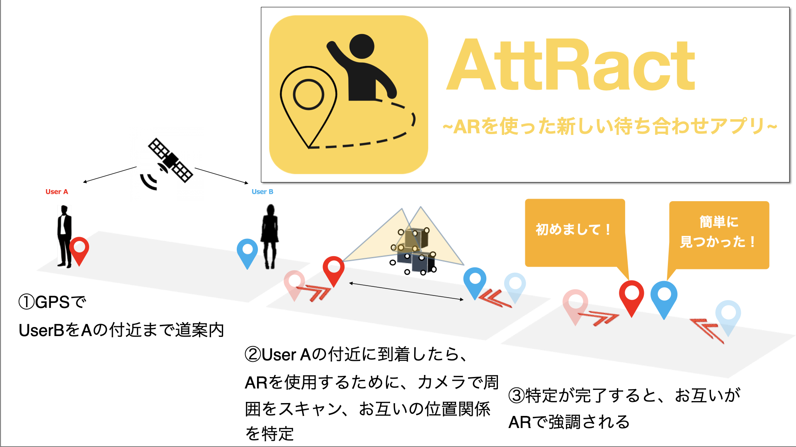

# AttRact

## "AttRact" とは？

待ち合わせを簡単にする、AR型スマートフォンアプリです。

待ち合わせをする方同士で位置情報をやり取りし、
スマホの画面越しにお互いをマーカー表示して、お相手を簡単に見つけ出します！

[**紹介動画をYouTubeにて公開中！**](https://youtu.be/ffVy2FNgCqo)

<iframe width="560" height="315" align="center" src="https://www.youtube.com/embed/ffVy2FNgCqo" title="YouTube video player" frameborder="0" 
        allow="accelerometer; autoplay; clipboard-write; encrypted-media; gyroscope; picture-in-picture" allowfullscreen></iframe>

## イベント参加

- [Sendai Micro Maker Faire 2022](https://makezine.jp/event/makerfaire/smmf2022/) にて、アプリAttRactの展示をおこないます！
  - 日時：2022年 6月 25日 (土)　13:00 - 17:00
  - 会場：協同組合仙台卸商センター 産業見本市会館 サンフェスタ 301，302 宮城県仙台市若林区卸町2丁目15-2

## Twitter & Mail

- [twitter](https://twitter.com/att_ract)
- Mail: [attract3dcgs@gmail.com](attract3dcgs@gmail.com)

## アップデート情報

2022年 9月 リリース予定！
